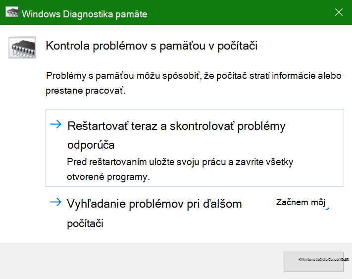

# Spustenie nástroja Windows Diagnostika pamäte v systéme Windows 10Run Windows Memory Diagnostics in Windows 10

Ak systém Windows a aplikácie v počítači zlyhajú, zmrazujú alebo pôsobia nestabilným spôsobom, môže sa stať, že máte problém s pamäťou počítača (RAM).If Windows and apps on your PC are crashing, freezing, or acting in an unstable manner, you may have a problem with the PC’s memory (RAM). Môžete spustiť Windows Diagnostika pamäte na kontrolu problémov s PC RAM.You can run the Windows Memory Diagnostic to check for problems with the PC’s RAM.

Do vyhľadávacieho poľa na paneli úloh zadajte príkaz **Diagnostika pamäte**a potom vyberte položku **Windows Diagnostika pamäte**.In the search box on your taskbar, type **memory diagnostic**, and then select **Windows Memory Diagnostic**. 

Ak chcete spustiť diagnostický, PC je potrebné reštartovať.To run the diagnostic, the PC needs to restart. Máte možnosť reštartovať okamžite (prosím uložte svoju prácu a zatvorte otvorené dokumenty a e-maily ako prvý), alebo naplánovať diagnostické spustiť automaticky pri ďalšom reštartovaní počítača:You have the option to restart immediately (please save your work and close open documents and e-mails first), or schedule the diagnostic to run automatically the next time the PC restarts:

Po reštartovaní počítača sa **nástroj Windows Diagnostika pamäte** spustí automaticky.When the PC restarts, the **Windows Memory Diagnostics Tool** will run automatically. Stav a priebeh sa zobrazí ako diagnostický beh a máte možnosť zrušiť diagnostiku stlačením klávesu **ESC** na klávesnici.Status and progress will be displayed as the diagnostics run, and you have the option of cancelling the diagnostics by hitting the **ESC** key on your keyboard.

Po dokončení diagnostiky sa systém Windows spustí normálne.When the diagnostics are complete, Windows will start normally.
Ihneď po reštarte, keď sa zobrazí pracovná plocha, zobrazí sa upozornenie (vedľa ikony **centra akcií** na paneli úloh), aby ste uviedli, či sa našli chyby pamäte.Immediately after restart, when the Desktop appears, a notification will appear (next to the **Action Center** icon on the taskbar), to indicate whether any memory errors were found. Príklad:For example:

Tu je ikona centra akcií:Here's the Action Center icon:  

A vzorové oznámenie:And a sample notification: 

Ak ste oznámenie vynechali, môžete na paneli úloh vybrať ikonu **centra akcií** , aby sa zobrazil **centrum akcií** a zobrazí sa posúvateľný zoznam upozornení.If you missed the notification, you can select the **Action Center** icon  on the taskbar to display the **Action Center** and see a scrollable list of notifications.

Ak chcete skontrolovať podrobné informácie, zadajte **udalosť** do vyhľadávacieho poľa na paneli úloh a potom vyberte položku **Zobrazovač udalostí**.To review detailed information, type **event** into the search box on your taskbar, and then select **Event Viewer**. V table **Zobrazovač udalostí**na ľavej strane prejdite na **denníky systému Windows > systém**.In the **Event Viewer**’s left-hand pane, navigate to **Windows Logs > System**. Na pravej table prehľadá zoznam pri pohľade na **zdrojový** stĺpec, až uvidíte udalosti s zdrojovú hodnotu **memorydiagnostics-výsledky**.In the right-hand pane, scan down the list while looking at the **Source** column, until you see events with Source value **MemoryDiagnostics-Results**. Zvýraznite každú takúto udalosť a pozrite si informácie o výsledku v poli na karte **Všeobecné** pod zoznamom.Highlight each such event and see the result information in the box under the **General** tab below the list.
